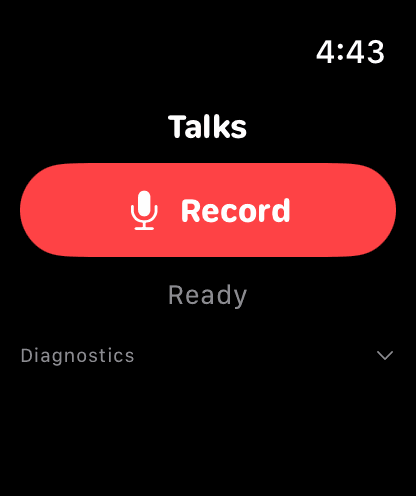
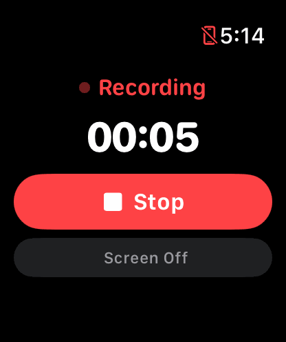
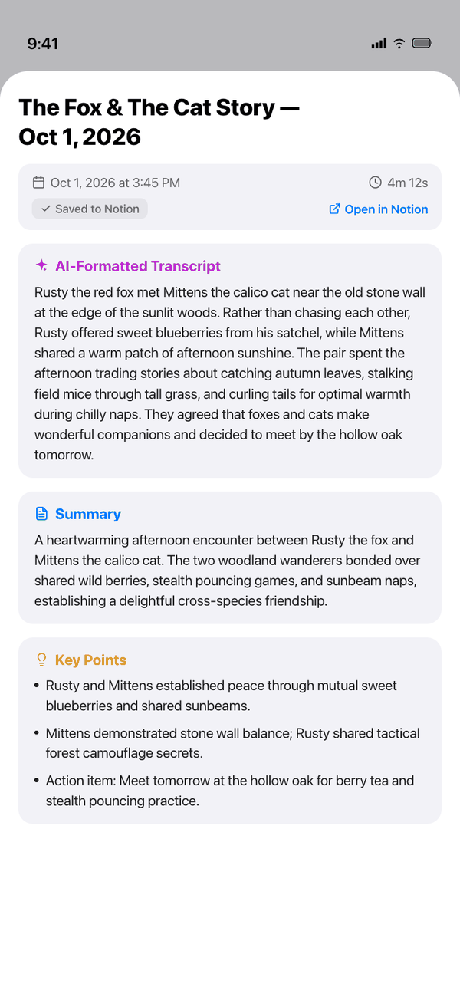
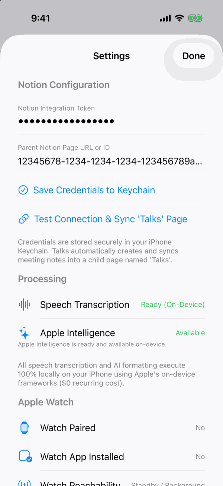

# Talks

[](https://github.com/sonawaneutkarsh/Talks/actions/workflows/ci.yml)

> Meeting capture for Apple Watch and iPhone: record on the Watch, transcribe and summarize on the iPhone with on-device models, and save the notes to Notion.

<table>
  <tr>
    <td align="center"></td>
    <td align="center"></td>
    <td align="center"></td>
    <td align="center"></td>
  </tr>
  <tr>
    <td align="center"><sub>Watch: ready</sub></td>
    <td align="center"><sub>Watch: recording</sub></td>
    <td align="center"><sub>iPhone: Talk detail</sub></td>
    <td align="center"><sub>iPhone: Settings</sub></td>
  </tr>
</table>

<sub>Screenshots use a demo recording. The parent page ID shown is a placeholder.</sub>

---

## Product Overview

**Talks** is an open-source meeting recorder for lectures, advising sessions, and research meetings. You record on the Apple Watch. The audio moves to the iPhone in the background. The iPhone transcribes it on device, uses Apple's on-device Foundation Models to write a title, summary, key points, decisions, and action items, and then creates a page in your Notion workspace.

- **No cloud AI processing**: Audio and transcripts are not sent to third-party speech or AI services. Transcription and structuring run on the iPhone. The only network traffic is the Notion API call that writes the finished notes to your own workspace.
- **No paid API keys**: Speech and language models are Apple's on-device frameworks. Notion uses a free internal integration token.
- **Screen Off mode**: During a meeting you can blank the Watch display while recording continues.

---

## System Architecture

```
┌─────────────────┐
│   Apple Watch   │
│  (TalksWatch)   │
└────────┬────────┘
         │
         │ 1. Record audio (AVAudioRecorder + WKExtendedRuntimeSession)
         │ 2. Optional Screen Off mode while recording
         │ 3. On Stop: background file transfer (WCSession.transferFile)
         ▼
┌─────────────────┐
│     iPhone      │
│     (Talks)     │
└────────┬────────┘
         │
         │ 4. Receive audio and move it into Documents/Recordings/
         │ 5. Enqueue a persistent job in JobQueueManager
         │ 6. Send the ACK to the Watch (WCSession.transferUserInfo)
         │
         ├───▶ [7. On-device speech transcription]
         │     • SpeechAnalyzer on iOS 26, guarded by a timeout watchdog
         │     • On-device SFSpeechRecognizer fallback (iOS 18, or if SpeechAnalyzer fails or hangs)
         │
         ├───▶ [8. On-device structuring with Apple Foundation Models]
         │     • Title, summary, key points, decisions, action items, follow-ups
         │
         └───▶ [9. Notion upload]
               • Creates a page under a 'Talks' child page of your configured parent page
               • Persists the page ID at creation; a retry appends only missing blocks
```

---

## Key Features

- **One-tap Watch recording**: A large Record button; Stop ends the recording and starts the transfer.
- **Screen Off mode**: Tap "Screen Off" while recording to show a black screen with a small corner indicator. A tap brings the controls back without stopping the recording.
- **ACK-gated transfer**: Audio leaves the Watch through `WCSession.transferFile`. The Watch deletes its copy only after the iPhone sends an acknowledgement for that recording ID, and the iPhone sends that acknowledgement only after the recording is saved in its job queue.
- **On-device transcription**: `SpeechAnalyzer` (iOS 26) with a watchdog. If it fails or hangs, the job falls back to on-device `SFSpeechRecognizer`, and SpeechAnalyzer is skipped for the rest of the session.
- **On-device structuring**: Apple Foundation Models produce the title, summary, key points, decisions, action items, and follow-ups. Long transcripts are split into chunks that fit the model's context window.
- **Notion page layout**: AI-formatted transcript, Summary, Key Points, Decisions, Action Items (as to-do blocks), Follow-Ups, and the unedited raw transcript at the bottom. Text is split to stay under Notion's 2,000-character block limit, and blocks are sent in batches of 100.
- **Persistent queue**: Jobs survive app termination and reboots. On relaunch, interrupted jobs are reset to the last safe state. Failed jobs can be retried with one tap.
- **Local deletion**: Swipe left on a completed or failed Talk to delete the local recording and metadata from the iPhone. Jobs that are still processing cannot be deleted. Notion pages are never deleted.

---

## Requirements

- **iPhone**: iOS 18.0 or later.
- **Apple Watch**: watchOS 11.0 or later.
- **Xcode**: Xcode 26 or later (iOS 26 SDK, which includes `SpeechAnalyzer` and `FoundationModels`). CI builds with Xcode 26.6.
- **What runs where**:
  - **iOS 26 with Apple Intelligence enabled** (iPhone 15 Pro, iPhone 16 series, or newer): the full pipeline runs automatically, from Watch recording to the Notion page.
  - **iOS 18, or iOS 26 without Apple Intelligence**: recording, transfer, and on-device transcription work. The job then waits at `.waitingForAI` with the transcript saved, and continues when Apple Intelligence becomes available on that device.
- **Notion**: an internal integration token and a parent page that is connected to the integration.

---

## Setup & Installation

### Step 1: Clone the Repository
```bash
git clone https://github.com/sonawaneutkarsh/Talks.git
cd Talks
```

### Step 2: Configure Notion Integration
1. Go to [Notion Developers](https://www.notion.so/my-integrations) and create a **New integration**.
2. Give it a name (e.g. `Talks Assistant`) and copy the **Internal Integration Token**.
3. Open Notion in your browser, then create or open the page where you want meeting notes stored (e.g. `Research Notes` or `Meetings`).
4. Click the `...` menu in the upper-right corner of that page, select **Connections**, and connect your integration.
5. Copy the page link or page ID (the 32-character hexadecimal string in the page URL).

### Step 3: Build & Deploy via Xcode
1. Open `Talks.xcodeproj` in Xcode.
2. Select the `Talks` scheme and choose your physical iPhone as the run destination.
3. Select your signing team under **Signing & Capabilities** for both `Talks` and `TalksWatch`.
4. Press **Cmd + R** to install and run Talks on your iPhone.
5. In the iPhone app, open **Settings (gear icon)**:
   - Paste your token into **Notion Integration Token**.
   - Paste your page URL or ID into **Parent Notion Page**.
   - Tap **Save Credentials to Keychain**.
   - Tap **Test Connection & Sync 'Talks' Page** to verify the setup.
6. Switch to the `TalksWatch` scheme, select your physical Apple Watch, and build and run.

### Using Talks on Your Own Apple Developer Account
1. **Choose a signing team**: Under **Signing & Capabilities**, select your personal or organization team for both the `Talks` (iOS) and `TalksWatch` (watchOS) targets.
2. **Unique bundle identifiers**: If `com.personal.talks` and `com.personal.talks.watchkitapp` conflict with App IDs on your account, change them to your own prefix (e.g. `com.yourname.talks` and `com.yourname.talks.watchkitapp`). The Watch app's bundle ID must start with the iOS app's bundle ID (`<iOS-Bundle-ID>.watchkitapp`). You can also set `bundleIdPrefix` in `project.yml` and run `xcodegen generate`.

---

## Tests

The XCTest suite lives in `TalksTests/` and runs on the iOS Simulator in CI ([`.github/workflows/ci.yml`](.github/workflows/ci.yml)) on every push to `main` and every pull request. CI also builds the watchOS app on its own.

**57 XCTest cases passing in CI** on the iOS Simulator.

```bash
xcodebuild test \
  -project Talks.xcodeproj \
  -scheme Talks \
  -destination 'platform=iOS Simulator,name=iPhone 17' \
  CODE_SIGNING_ALLOWED=NO
```

| File | What it covers |
|---|---|
| `JobQueueTests.swift` | Queue persistence and relaunch reconciliation, single-worker processing, retry, background-time expiration, corrupt queue recovery, local deletion rules |
| `NotionServiceTests.swift` | Page layout, 2,000-character splitting, 429 retry, idempotent retry that appends only missing blocks, failure of the existing-block count |
| `TranscriptionTests.swift` | Audio file checks, transcript chunking, the speech watchdog, SpeechAnalyzer → SFSpeechRecognizer fallback, circuit breaker |
| `ConnectivityAndLaunchTests.swift` | Enqueue-before-ACK on the iPhone, ACK-gated deletion on the Watch, structured logging, launch-time UI construction |

Queue tests use a temporary directory and injected pipeline stages (`QueueDependencies`), so they do not depend on the app's shared state or on real Speech, Apple Intelligence, or Notion services.

**Simulator limits**: The simulator cannot pair an Apple Watch, record from the Watch microphone, or run Apple Intelligence reliably. CI therefore does not cover `WCSession` delivery between devices, real speech recognition, or real Foundation Models output. The code on each side of those boundaries is tested; end-to-end behavior needs a physical iPhone and Apple Watch.

---

## Physical Device Troubleshooting Guide

### WatchConnectivity Pairing & File Delivery
- **Watch app installed**: `TalksWatch.app` is embedded inside `Talks.app` (configured in `project.yml`).
- **Transfer timing**: `WCSession.transferFile` runs out of process. Delivery time depends on the Bluetooth/Wi-Fi link and on when watchOS schedules the transfer.
- **Local retention on the Watch**: Recordings stay in `Documents/WatchRecordings/` on the Watch until the iPhone's ACK (`transferUserInfo`) arrives. If you walk out of range, the transfer resumes when the devices reconnect.

### Speech Model Assets
- iOS downloads the speech model once, over Wi-Fi, when it is first needed. Check **Settings → Processing** to confirm that transcription is ready.
- If SpeechAnalyzer exceeds its timeout, Talks falls back to on-device `SFSpeechRecognizer`. The audio is kept until the job finishes.

### Notion Connection
- If the connection fails, confirm that your integration is connected to the parent page via **Page menu (...) → Connections**.
- The Notion token is stored in the iOS Keychain.

---

## Architecture & Design Decisions

### Why On-Device AI Processing?
- **Confidentiality**: Research meetings can involve unpublished data or confidential disclosures. Keeping transcription and structuring on the device means those conversations are not sent to third-party AI services.
- **No per-use cost**: Cloud speech and LLM APIs charge per minute or per token. On-device models have no usage fees.

### Why Background Transfers Instead of Live Streaming?
- Streaming audio over Bluetooth for a 90-minute lecture drains the Watch battery and loses audio when you step away from the phone.
- Talks records locally to AAC (`.m4a`) and transfers the finished file, so a temporary disconnect delays the transfer instead of dropping audio.

### Crash & Force-Quit Resilience
- Every state change is written atomically to a JSON job queue (`Documents/queue.json`).
- On the next launch or background processing run, interrupted jobs are reset to the last safe state (`.transcribing` → `.received`, `.formatting` → `.waitingForAI`, `.uploadingToNotion` → `.waitingForNotion`). A job whose audio is missing is marked failed instead of looping.
- Each job is attempted at most once per processing pass, so a job that is waiting for Apple Intelligence or for Notion credentials does not keep the processor busy.
- **Duplicate prevention**: Talks stores the Notion page ID as soon as Notion returns it. On retry it reuses that page, counts the blocks already on it, and appends only the missing ones. If that count cannot be read completely, the upload fails and is retried later rather than appending blocks that may already exist. Talks does not search Notion for existing pages, so a crash in the short window between page creation and saving its ID can still produce a second page.

---

## Privacy & Recording Consent

- **Local processing**: Audio and transcripts stay on your devices and are not sent to third-party AI or speech services. The only external network traffic is the Notion API, using your own integration token.
- **Recording consent**: Follow all applicable local, state, and institutional laws and policies on recording consent before you record lectures, advising sessions, or meetings.

---

## License

MIT License. See [LICENSE](LICENSE) for details.
